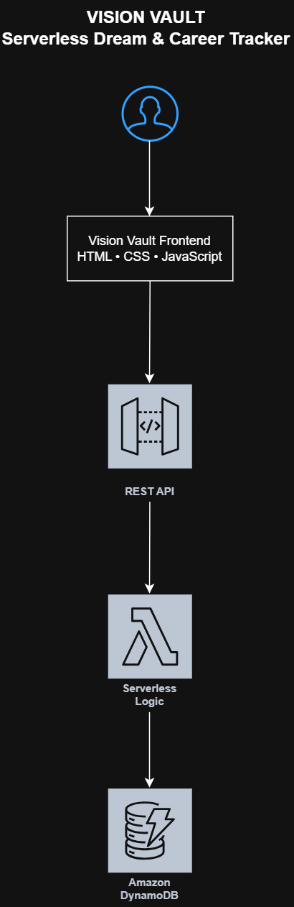
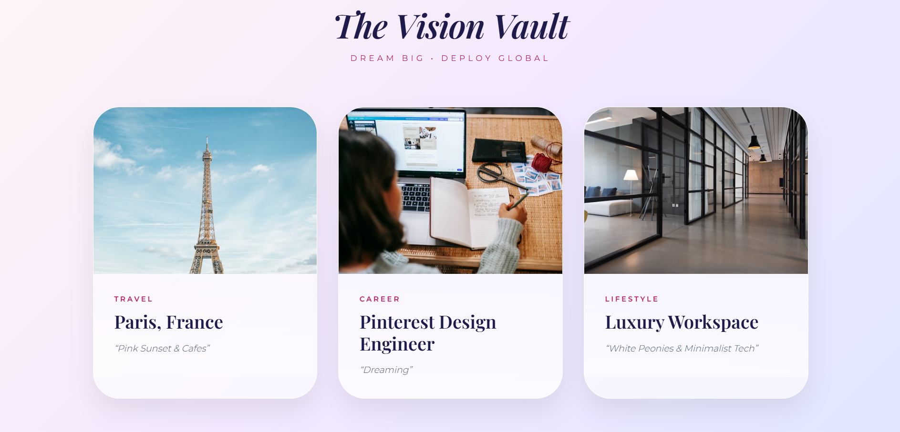

# Vision Vault

## Serverless Dream & Career Tracker on AWS

Vision Vault is a cloud-based serverless application designed to track travel dreams, career aspirations, and lifestyle goals through a modern aesthetic dashboard.

---

## Features

- Travel destination tracking
- Career goal management
- Lifestyle inspiration dashboard
- Glassmorphism-inspired UI
- Dynamic serverless backend architecture

---

## AWS Services Used

- AWS Lambda
- Amazon API Gateway
- Amazon DynamoDB

---

## Architecture Diagram

---

## UI Preview

---

## Architecture Flow

User  
↓  
Frontend UI  
↓  
API Gateway  
↓  
AWS Lambda  
↓  
Amazon DynamoDB

---

## Learning Outcomes

This project helped demonstrate:

- Serverless application architecture
- API-driven frontend integration
- Cloud database workflows
- AWS Lambda function integration
- DynamoDB data handling
- Frontend and backend connectivity concepts

---

## Project Status

Vision Vault Online
